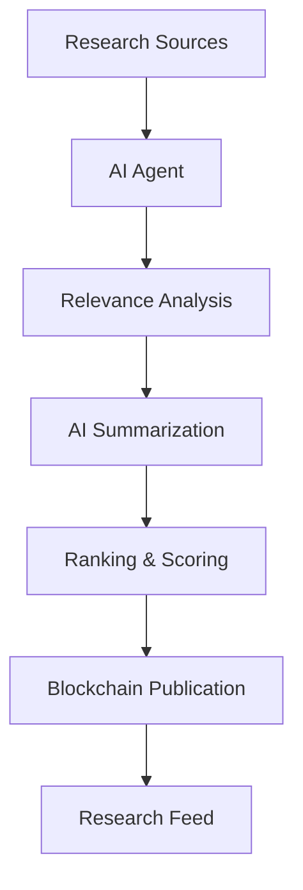

# 🚀 RitualFeed

> Your Autonomous AI Research Analyst on the Blockchain

RitualFeed is an AI-powered research discovery platform that automatically finds, analyzes, ranks, summarizes, and publishes the latest Artificial Intelligence research papers. Instead of manually searching through hundreds of academic papers, RitualFeed continuously scans trusted research sources and delivers the most relevant discoveries in a clean, searchable feed.

---

## 🌟 Features

- 🔍 Automatic Research Discovery
- 🤖 AI-Powered Paper Analysis
- 📝 Intelligent Research Summaries
- 📊 Relevance Scoring System
- 🔗 Blockchain-Based Publication
- 💳 Wallet-Based Subscription System
- ⚡ Real-Time Research Updates
- 🌙 Dark Mode Support
- 📱 Mobile Responsive Design

---

## 🎯 Problem Statement

The AI research ecosystem grows rapidly every day, making it difficult for students, researchers, developers, and organizations to stay updated.

Common challenges include:

- Too many papers published daily
- Time-consuming manual research
- Important discoveries getting overlooked
- Difficulty tracking multiple research sources

RitualFeed solves these challenges by using autonomous AI agents to discover, evaluate, and summarize research automatically.

---

## 🔄 How It Works



---

## 🧠 Autonomous AI Agent

The RitualFeed AI Agent continuously:

1. Searches for newly published research papers
2. Retrieves metadata and content
3. Evaluates relevance and importance
4. Generates concise summaries
5. Publishes insights on-chain
6. Updates the public research feed

---

## 📚 Research Sources

RitualFeed aggregates research from trusted academic platforms:

- arXiv
- Semantic Scholar
- PubMed
- CrossRef

This ensures broad and reliable research coverage.

---

## 🏷 Research Categories

The platform automatically classifies papers into:

### Machine Learning (ML)

Training methods, optimization, predictive systems, and neural networks.

### Natural Language Processing (NLP)

Large Language Models, chatbots, text generation, and language understanding.

### Computer Vision (CV)

Image processing, object detection, video understanding, and multimodal AI.

### Reinforcement Learning (RL)

Autonomous agents, robotics, and decision-making systems.

---

## 🤖 AI-Powered Summaries

Each research paper is transformed into an easy-to-understand summary containing:

- Key Contributions
- Main Findings
- Research Impact
- Practical Applications
- Simplified Explanation

This helps both technical and non-technical users quickly understand new research.

---

## 📈 Relevance Scoring

Every paper receives an AI-generated relevance score.

| Score Range | Meaning |
|------------|----------|
| 85%+ | Highly Relevant |
| 65% - 84% | Moderately Relevant |
| Below 65% | Lower Priority |

This allows users to focus on the most impactful research first.

---

## 🔗 Blockchain Integration

RitualFeed publishes research insights on-chain using Ritual Chain.

Benefits include:

- Transparency
- Immutability
- Decentralization
- Verifiable Publication History
- Trustless Access

---

## 💳 Subscription System

Users can subscribe through their crypto wallets.

### Benefits

- Wallet-Based Authentication
- No Traditional Accounts Required
- Decentralized Access Control
- Transparent Subscription Management

---

## ⚡ Real-Time Updates

Whenever new research becomes available:

- AI agents analyze the content
- Summaries are generated
- Research is ranked
- Results are published automatically
- Subscribers gain instant access

---

## 🏗 System Architecture

```text
Research Databases
        │
        ▼
Autonomous AI Agent
        │
        ├── Paper Discovery
        ├── Classification
        ├── Summarization
        ├── Relevance Scoring
        │
        ▼
Ritual Chain
        │
        ▼
RitualFeed Platform
```

---

## 💡 Use Cases

### 🎓 Students

Stay updated with the latest AI research without reading every paper.

### 👨‍💻 Developers

Discover cutting-edge techniques and innovations.

### 🔬 Researchers

Track developments across multiple research domains.

### 🚀 Startups

Monitor emerging technologies and market-changing discoveries.

### 📈 Investors

Identify promising research trends and future opportunities.

---

## 🛠 Technology Stack

### Frontend

- React
- TypeScript
- Tailwind CSS
- Wagmi

### Blockchain

- Ritual Chain
- Smart Contracts

### AI Layer

- Research Retrieval
- AI Summarization
- Classification Models
- Relevance Ranking

### Data Sources

- arXiv
- Semantic Scholar
- PubMed
- CrossRef

---

## 🔮 Future Roadmap

- Personalized Research Recommendations
- Research Trend Analytics
- Multi-Language Summaries
- AI-Powered Question Answering
- Email Digest Delivery
- Citation Impact Prediction
- Research Collaboration Features

---

## 📌 Vision

RitualFeed aims to become the autonomous research layer of the internet, where AI continuously discovers, understands, and delivers human knowledge in real time.

---

## ⭐ Why RitualFeed?

RitualFeed is more than a research aggregator.

It is an autonomous AI-powered research analyst that works 24/7 to transform overwhelming academic information into actionable knowledge.

**Discover Less. Learn More. Stay Ahead.**
